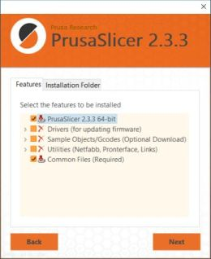

# PrusaSlicer
## Installation | Konfiguration `03.12.2012`
Beschrieben wird der Download, die Installation und die darauffolgende Konfiguration des PrusaSlicer's.

Zum Zeitpunkt dieser Dokumentation liegen die Daten in folgender Version vor:

| :Datei | Version |
| --- | ---: |
| PrusaSlicer | 2.3.3 |
| Konfiguration | 2021-12-02 |

### Download
Der PrusaSlicer kann als Standalone (ohne Treiber/Firmware der PrusaPrinter) über die offizielle [Webseite](https://www.prusa3d.com/page/prusaslicer_424/) herunter geladen werden.  
Die Konfiguration befindet sich in [diesem](./) Ordner.

### Installation
Die Installation verläuft wie gewohnt.  
Trotz der *Standalone*-Definition können die vordefinierten Haken im Reiter ***Features*** unter ***Drivers*** und ***Utilities*** entfernt werden.

### Konfiguration
Nach dem ersten Start des PrusaSlicer's kann der Wizard abgebrochen werden. Die Konfiguration beinhaltet alle benötigten Daten.

> Import
> * `Datei > Import > Importiere Konfigurationssammlung...`

> Export
> * `Datei > Export > Konfigurationssammlung exportieren...`