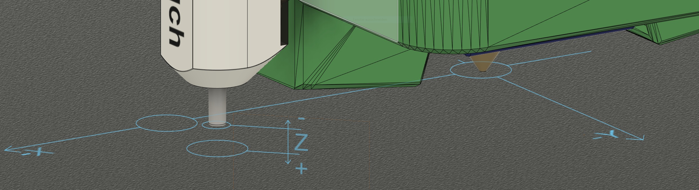

# Marlin Firmware


## **Hardware**
Jeder 3D-Drucker und deren Modifikationen sind differenziert zu konfigurieren.

In diesem Repository werden folgende Drucker- und Motherboard-Kombinationen behandelt
| 3D-Drucker (*) | Board (*) | Steppertreiber (*) |
| :- | :- | :- |
| [Creality Ender-5](./datasheets/creality_ender-5/) | [MKS Gen 1.4](./datasheets/mks_gen_1.4/) | [TMC2208](./datasheets/tmc2208/) |
| [Creality Ender-5 Plus](./datasheets/creality_ender-5_plus/) | [SKR 1.4 Turbo](./datasheets/skr_1.4_turbo/) | [TMC2209](./datasheets/tmc2209/) |

(*) Die Datenblätter sind hinter den Links erreichbar.
<br><br>

## **Software**

| Datei | Version (**) | Link |
| :- | -: | :-: |
| Visual Studio Code | 1.63.2 | [Webseite](https://code.visualstudio.com/download) |
| + PlatformIO IDE | 2.100.151 |  |
| + C/C++ | 1.7.1 |  |
| + C/C++ Extension Pack | 1.1.0 |  |
| Git | 2.34.1 | [Webseite](https://git-scm.com/download/) |
| GitHub Desktop | 2.9.6 | [Webseite](https://desktop.github.com/) |
| Marlin Firmware | 2.0.9.2 | [Webseite](https://marlinfw.org/meta/download/) \| [GitHub](https://github.com/MarlinFirmware/Marlin) |
| - `Fork` UnusedSpace | 2.0.9.2 | [GitHub UnusedSpace](https://github.com/UnusedSpace/MarlinFw) |


(**) Die Versionen beziehen sich auf den Zeitpunkt der Erstellung dieser Dokumentation.
<br>Als Grundsystem für diese Dokumentation liegt Windows 10 vor.

<br>


## Software - Installation | Konfiguration
<details>
    <summary><b><i> Visual Studio Code </i></b></summary>

Die Grundinstallation erfolgt nach dem Download wie gewohnt. Nach dem ersten Start kann das Sprachpaket heruntergeladen und aktiviert werden.

Erforderliche Erweiterungen
- `PlatformIO IDE` (Erforderlicher Compiler für MarlinFirmware)
- `C/C++` (Genutzte Programmiersprache der MarlinFirmware)
- `C/C++` Extension Pack (Diverse nützliche Erweiterungen der Programmiersprache)

</details>


<details>
    <summary><b><i> Git for Windows </i></b></summary>

Die Installation erfordert einige Voreinstellungen, welche sich nach den Gewohnheiten und genutzten Sub-Programmen des jeweiligen Nutzers orientiert.

Optionale Voreinstellungen
- Default Editor used by Git *->* Use Visual Studio Code as Git's default Editor
- Name of the initial branch in new repositories *->* Let Git decide
- PATH Environment *->* Git from the command line and also from 3rd-party software
- SSH executable *->* Use external OpenSSH
- HTTPS transport backend *->* Use the native Windows Secure Channel library
- Line ending conversions *->* Checkout Windows-style, commit Unix-style line endings
- Terminal emulator to use with Git Bash *->* Use Windows' default console window
- Default behaviour of \`git pull` *->* Default (fast-forward or merge)
- Credential helper *->* Git Credential Manager
- Extra Options *->* Enable file system caching

</details>


<details>
    <summary><b><i> GitHub Desktop </i></b></summary>

Die Grundinstallation erfolgt nach dem Download wie gewohnt. Ein GitHub-Account ist für den weiteren Verlauf erforderlich.

</details>

<br>

## Marlin Firmware - Download | Konfiguration | Flash
<details>
    <summary><b><i> Download - Original oder Fork </i></b></summary>

Mittels `GitHub Desktop`, dem Punkt `Clone a repository from the Internet...` und die Eingabe der GitHub-Webadresse `https://github.com/MarlinFirmware/Marlin` kann das Original-Repository ge`Clone`d werden.

Die GitHub-Webadresse des hier behandelteten `Fork`s lautet `https://github.com/UnusedSpace/MarlinFw`.

Nachdem das entsprechende Repository heruntergeladen wurde, kann es mit `Open in Visual Studio Code` bearbeitet werden.

</details>

<details>
    <summary><b><i> Konfiguration </i></b></summary>

Konfigurationsanleitungen

  *   <details>
        
       <summary><b> BLTouch Offsets </b></summary>

        Text

        

        Text

       </details>

Dateikonfigurationen


   *   <details>
        
       <summary><b> root/platformio.ini </b></summary>

        Um die Firmware für den Chipsatz des Motherboards zu kompilieren, benötigt *PlatformIO* die entsprechenden Informationen. Die Bezeichnung ist dem Datenblatt des jeweiligen Motherboards zu entnehmen.

        

        | Motherboard | Chipsatz |
        | :- | :- |
        | MKS Gen 1.4 | mega2560 |
        | SKR 1.4 Turbo | LPC1769 |

       </details>

   *   <details>

       <summary><b> root/Marlin/Configuration.h </b></summary>

        In der Datei ***Configuration.h*** wird die generelle Grundkonfiguration vorgenommen. In diesem Setup wird kein Display eingesetzt! Erforderliche und optionale Einstellungen sind als solche gekennzeichnet.

        *   <details>
            
            <summary> <i> Optional </i>- STRING_CONFIG_H_AUTHOR </summary>

            `Description in progress...`

            > Original
            > ```
            > #define STRING_CONFIG_H_AUTHOR "(none, default config)" // Who made the changes.

            > MKS Gen 1.4 | SKR 1.4 Turbo
            > ```
            > #define STRING_CONFIG_H_AUTHOR "(UnusedSpace | MarlinFw <VERSION>)" // Who made the changes.

            </details>

        *   <details>
            
            <summary> <i> Optional </i>- SHOW_BOOTSCREEN </summary>

            `Description in progress...`

            > Original
            > ```
            > #define SHOW_BOOTSCREEN

            > MKS Gen 1.4 | SKR 1.4 Turbo
            > ```
            > //#define SHOW_BOOTSCREEN
            
            </details>

        *   <details>
            
            <summary> <i> Erforderlich </i>- SERIAL_PORT </summary>

            `Description in progress...`

            > Original
            > ```
            > #define SERIAL_PORT 0

            > MKS Gen 1.4
            > ```
            > #define SERIAL_PORT 0

            > SKR 1.4 Turbo
            > ```
            > #define SERIAL_PORT -1
            
            </details>

        *   <details>
            
            <summary> <i> Erforderlich </i>- BAUDRATE </summary>

            `Description in progress...`

            > Original
            > ```
            > #define BAUDRATE 250000

            > MKS Gen 1.4 | SKR 1.4 Turbo
            > ```
            > #define BAUDRATE 115200
            
            </details>

        *   <details>
            
            <summary> <i> Erforderlich </i>- MOTHERBOARD </summary>

            `Description in progress...`

            > Original
            > ```
            > #define MOTHERBOARD BOARD_RAMPS_14_EFB

            > MKS Gen 1.4
            > ```
            > #define MOTHERBOARD BOARD_MKS_GEN_13

            > SKR 1.4 Turbo
            > ```
            > #define MOTHERBOARD BOARD_BTT_SKR_V1_4_TURBO
            
            </details>

        *   <details>
            
            <summary> <i> Optional </i>- CUSTOM_MACHINE_NAME </summary>

            `Description in progress...`

            > Original
            > ```
            > //#define CUSTOM_MACHINE_NAME "3D Printer"

            > MKS Gen 1.4
            > ```
            > #define CUSTOM_MACHINE_NAME "Creality Ender-5"

            > SKR 1.4 Turbo
            > ```
            > #define CUSTOM_MACHINE_NAME "Creality Ender-5 Plus"
            
            </details>

        *   <details>
            
            <summary> <i> Erforderlich </i>- TEMP_SENSOR_BED </summary>

            `Description in progress...`

            > Original
            > ```
            > #define TEMP_SENSOR_BED 0

            > MKS Gen 1.4 | SKR 1.4 Turbo
            > ```
            > #define TEMP_SENSOR_BED 1
            
            </details>

        *   <details>
            <summary> <i> Optional </i>- PID_PARAMS_PER_HOTEND </summary>

            `Description in progress...`

            > Original
            > ```
            > #if ENABLED(PIDTEMP)
            >   //#define PID_EDIT_MENU         // Add PID editing to the "Advanced Settings" menu. (~700 bytes of PROGMEM)
            >   //#define PID_AUTOTUNE_MENU     // Add PID auto-tuning to the "Advanced Settings" menu. (~250 bytes of PROGMEM)
            >   //#define PID_PARAMS_PER_HOTEND // Uses separate PID parameters for each extruder (useful for mismatched extruders)
            >                                   // Set/get with gcode: M301 E[extruder number, 0-2]
            >
            >   #if ENABLED(PID_PARAMS_PER_HOTEND)
            >     // Specify up to one value per hotend here, according to your setup.
            >     // If there are fewer values, the last one applies to the remaining hotends.
            >     #define DEFAULT_Kp_LIST {  22.20,  22.20 }
            >     #define DEFAULT_Ki_LIST {   1.08,   1.08 }
            >     #define DEFAULT_Kd_LIST { 114.00, 114.00 }
            >   #else
            >     #define DEFAULT_Kp  22.20
            >     #define DEFAULT_Ki   1.08
            >     #define DEFAULT_Kd 114.00
            >   #endif
            > #endif // PIDTEMP

            > MKS Gen 1.4
            > ```
            > #if ENABLED(PIDTEMP)
            >   //#define PID_EDIT_MENU         // Add PID editing to the "Advanced Settings" menu. (~700 bytes of PROGMEM)
            >   //#define PID_AUTOTUNE_MENU     // Add PID auto-tuning to the "Advanced Settings" menu. (~250 bytes of PROGMEM)
            >   //#define PID_PARAMS_PER_HOTEND // Uses separate PID parameters for each extruder (useful for mismatched extruders)
            >                                   // Set/get with gcode: M301 E[extruder number, 0-2]
            >
            >   #if ENABLED(PID_PARAMS_PER_HOTEND)
            >     // Specify up to one value per hotend here, according to your setup.
            >     // If there are fewer values, the last one applies to the remaining hotends.
            >     #define DEFAULT_Kp_LIST {  22.20,  22.20 }
            >     #define DEFAULT_Ki_LIST {   1.08,   1.08 }
            >     #define DEFAULT_Kd_LIST { 114.00, 114.00 }
            >   #else
            >     #define DEFAULT_Kp  30.50
            >     #define DEFAULT_Ki   3.92
            >     #define DEFAULT_Kd  59.34
            >   #endif
            > #endif // PIDTEMP

            > SKR 1.4 Turbo - Drucker 1
            > ```
            > #if ENABLED(PIDTEMP)
            >   //#define PID_EDIT_MENU         // Add PID editing to the "Advanced Settings" menu. (~700 bytes of PROGMEM)
            >   //#define PID_AUTOTUNE_MENU     // Add PID auto-tuning to the "Advanced Settings" menu. (~250 bytes of PROGMEM)
            >   //#define PID_PARAMS_PER_HOTEND // Uses separate PID parameters for each extruder (useful for mismatched extruders)
            >                                   // Set/get with gcode: M301 E[extruder number, 0-2]
            >
            >   #if ENABLED(PID_PARAMS_PER_HOTEND)
            >     // Specify up to one value per hotend here, according to your setup.
            >     // If there are fewer values, the last one applies to the remaining hotends.
            >     #define DEFAULT_Kp_LIST {  22.20,  22.20 }
            >     #define DEFAULT_Ki_LIST {   1.08,   1.08 }
            >     #define DEFAULT_Kd_LIST { 114.00, 114.00 }
            >   #else
            >     #define DEFAULT_Kp  28.08
            >     #define DEFAULT_Ki   2.79
            >     #define DEFAULT_Kd  70.67
            >   #endif
            > #endif // PIDTEMP
            
            > SKR 1.4 Turbo - Drucker 2
            > ```
            > #if ENABLED(PIDTEMP)
            >   //#define PID_EDIT_MENU         // Add PID editing to the "Advanced Settings" menu. (~700 bytes of PROGMEM)
            >   //#define PID_AUTOTUNE_MENU     // Add PID auto-tuning to the "Advanced Settings" menu. (~250 bytes of PROGMEM)
            >   //#define PID_PARAMS_PER_HOTEND // Uses separate PID parameters for each extruder (useful for mismatched extruders)
            >                                   // Set/get with gcode: M301 E[extruder number, 0-2]
            >
            >   #if ENABLED(PID_PARAMS_PER_HOTEND)
            >     // Specify up to one value per hotend here, according to your setup.
            >     // If there are fewer values, the last one applies to the remaining hotends.
            >     #define DEFAULT_Kp_LIST {  22.20,  22.20 }
            >     #define DEFAULT_Ki_LIST {   1.08,   1.08 }
            >     #define DEFAULT_Kd_LIST { 114.00, 114.00 }
            >   #else
            >     #define DEFAULT_Kp  30.56
            >     #define DEFAULT_Ki   3.08
            >     #define DEFAULT_Kd  75.82
            >   #endif
            > #endif // PIDTEMP

            > SKR 1.4 Turbo - Drucker 3
            > ```
            > #if ENABLED(PIDTEMP)
            >   //#define PID_EDIT_MENU         // Add PID editing to the "Advanced Settings" menu. (~700 bytes of PROGMEM)
            >   //#define PID_AUTOTUNE_MENU     // Add PID auto-tuning to the "Advanced Settings" menu. (~250 bytes of PROGMEM)
            >   //#define PID_PARAMS_PER_HOTEND // Uses separate PID parameters for each extruder (useful for mismatched extruders)
            >                                   // Set/get with gcode: M301 E[extruder number, 0-2]
            >
            >   #if ENABLED(PID_PARAMS_PER_HOTEND)
            >     // Specify up to one value per hotend here, according to your setup.
            >     // If there are fewer values, the last one applies to the remaining hotends.
            >     #define DEFAULT_Kp_LIST {  22.20,  22.20 }
            >     #define DEFAULT_Ki_LIST {   1.08,   1.08 }
            >     #define DEFAULT_Kd_LIST { 114.00, 114.00 }
            >   #else
            >     #define DEFAULT_Kp  27.11
            >     #define DEFAULT_Ki   2.62
            >     #define DEFAULT_Kd  70.12
            >   #endif
            > #endif // PIDTEMP

            </details>

        *   <details>
            
            <summary> <i> Erforderlich </i>- PIDTEMPBED </summary>

            `Description in progress...`

            > Original
            > ```
            > //#define PIDTEMPBED

            > MKS Gen 1.4 | SKR 1.4 Turbo
            > ```
            > #define PIDTEMPBED
            
            </details>

        *   <details>
            <summary> <i> Optional </i>- PIDTEMPBED </summary>

            `Description in progress...`

            > Original
            > ```
            > #if ENABLED(PIDTEMPBED)
            >   //#define MIN_BED_POWER 0
            >   //#define PID_BED_DEBUG // Sends debug data to the serial port.
            >
            >   // 120V 250W silicone heater into 4mm borosilicate (MendelMax 1.5+)
            >   // from FOPDT model - kp=.39 Tp=405 Tdead=66, Tc set to 79.2, aggressive factor of .15 (vs .1, 1, 10)
            >   #define DEFAULT_bedKp  65.17
            >   #define DEFAULT_bedKi  12.05
            >   #define DEFAULT_bedKd 234.92
            >
            >   // FIND YOUR OWN: "M303 E-1 C8 S90" to run autotune on the bed at 90 degreesC for 8 cycles.
            > #endif // PIDTEMPBED

            > MKS Gen 1.4
            > ```
            > #if ENABLED(PIDTEMPBED)
            >   //#define MIN_BED_POWER 0
            >   //#define PID_BED_DEBUG // Sends debug data to the serial port.
            >
            >   // 120V 250W silicone heater into 4mm borosilicate (MendelMax 1.5+)
            >   // from FOPDT model - kp=.39 Tp=405 Tdead=66, Tc set to 79.2, aggressive factor of .15 (vs .1, 1, 10)
            >   #define DEFAULT_bedKp  53.72
            >   #define DEFAULT_bedKi  10.09
            >   #define DEFAULT_bedKd 190.72
            >
            >   // FIND YOUR OWN: "M303 E-1 C8 S90" to run autotune on the bed at 90 degreesC for 8 cycles.
            > #endif // PIDTEMPBED

            > SKR 1.4 Turbo - Drucker 1
            > ```
            > #if ENABLED(PIDTEMPBED)
            >   //#define MIN_BED_POWER 0
            >   //#define PID_BED_DEBUG // Sends debug data to the serial port.
            >
            >   // 120V 250W silicone heater into 4mm borosilicate (MendelMax 1.5+)
            >   // from FOPDT model - kp=.39 Tp=405 Tdead=66, Tc set to 79.2, aggressive factor of .15 (vs .1, 1, 10)
            >   #define DEFAULT_bedKp 119.40
            >   #define DEFAULT_bedKi  10.21
            >   #define DEFAULT_bedKd 930.67
            >
            >   // FIND YOUR OWN: "M303 E-1 C8 S90" to run autotune on the bed at 90 degreesC for 8 cycles.
            > #endif // PIDTEMPBED
            
            > SKR 1.4 Turbo - Drucker 2
            > ```
            > #if ENABLED(PIDTEMPBED)
            >   //#define MIN_BED_POWER 0
            >   //#define PID_BED_DEBUG // Sends debug data to the serial port.
            >
            >   // 120V 250W silicone heater into 4mm borosilicate (MendelMax 1.5+)
            >   // from FOPDT model - kp=.39 Tp=405 Tdead=66, Tc set to 79.2, aggressive factor of .15 (vs .1, 1, 10)
            >   #define DEFAULT_bedKp 109.47
            >   #define DEFAULT_bedKi   9.23
            >   #define DEFAULT_bedKd 866.09
            >
            >   // FIND YOUR OWN: "M303 E-1 C8 S90" to run autotune on the bed at 90 degreesC for 8 cycles.
            > #endif // PIDTEMPBED

            > SKR 1.4 Turbo - Drucker 3
            > ```
            > #if ENABLED(PIDTEMPBED)
            >   //#define MIN_BED_POWER 0
            >   //#define PID_BED_DEBUG // Sends debug data to the serial port.
            >
            >   // 120V 250W silicone heater into 4mm borosilicate (MendelMax 1.5+)
            >   // from FOPDT model - kp=.39 Tp=405 Tdead=66, Tc set to 79.2, aggressive factor of .15 (vs .1, 1, 10)
            >   #define DEFAULT_bedKp 132.86
            >   #define DEFAULT_bedKi  12.09
            >   #define DEFAULT_bedKd 973.49
            >
            >   // FIND YOUR OWN: "M303 E-1 C8 S90" to run autotune on the bed at 90 degreesC for 8 cycles.
            > #endif // PIDTEMPBED

            </details>

        *   <details>
            
            <summary> <i> Erforderlich </i>- Endstop Settings </summary>

            `Description in progress...`

            > Original
            > ```
            > // Specify here all the endstop connectors that are connected to any endstop or probe.
            > // Almost all printers will be using one per axis. Probes will use one or more of the
            > // extra connectors. Leave undefined any used for non-endstop and non-probe purposes.
            > #define USE_XMIN_PLUG
            > #define USE_YMIN_PLUG
            > #define USE_ZMIN_PLUG
            > //#define USE_IMIN_PLUG
            > //#define USE_JMIN_PLUG
            > //#define USE_KMIN_PLUG
            > //#define USE_XMAX_PLUG
            > //#define USE_YMAX_PLUG
            > //#define USE_ZMAX_PLUG
            > //#define USE_IMAX_PLUG
            > //#define USE_JMAX_PLUG
            > //#define USE_KMAX_PLUG

            > MKS Gen 1.4 | SKR 1.4 Turbo
            > ```
            > // Specify here all the endstop connectors that are connected to any endstop or probe.
            > // Almost all printers will be using one per axis. Probes will use one or more of the
            > // extra connectors. Leave undefined any used for non-endstop and non-probe purposes.
            > //#define USE_XMIN_PLUG
            > //#define USE_YMIN_PLUG
            > #define USE_ZMIN_PLUG
            > //#define USE_IMIN_PLUG
            > //#define USE_JMIN_PLUG
            > //#define USE_KMIN_PLUG
            > #define USE_XMAX_PLUG
            > #define USE_YMAX_PLUG
            > //#define USE_ZMAX_PLUG
            > //#define USE_IMAX_PLUG
            > //#define USE_JMAX_PLUG
            > //#define USE_KMAX_PLUG
            
            </details>

        *   <details>
            
            <summary> <i> Erforderlich </i>- Stepper Drivers </summary>

            `Description in progress...`

            > Original
            > ```
            > #define X_DRIVER_TYPE  A4988
            > #define Y_DRIVER_TYPE  A4988
            > #define Z_DRIVER_TYPE  A4988
            > //#define X2_DRIVER_TYPE A4988
            > //#define Y2_DRIVER_TYPE A4988
            > //#define Z2_DRIVER_TYPE A4988
            > //#define Z3_DRIVER_TYPE A4988
            > //#define Z4_DRIVER_TYPE A4988
            > //#define I_DRIVER_TYPE  A4988
            > //#define J_DRIVER_TYPE  A4988
            > //#define K_DRIVER_TYPE  A4988
            > #define E0_DRIVER_TYPE A4988
            > //#define E1_DRIVER_TYPE A4988
            > //#define E2_DRIVER_TYPE A4988
            > //#define E3_DRIVER_TYPE A4988
            > //#define E4_DRIVER_TYPE A4988
            > //#define E5_DRIVER_TYPE A4988
            > //#define E6_DRIVER_TYPE A4988
            > //#define E7_DRIVER_TYPE A4988

            > MKS Gen 1.4
            > ```
            > #define X_DRIVER_TYPE  TMC2208
            > #define Y_DRIVER_TYPE  TMC2208
            > #define Z_DRIVER_TYPE  TMC2208
            > //#define X2_DRIVER_TYPE A4988
            > //#define Y2_DRIVER_TYPE A4988
            > //#define Z2_DRIVER_TYPE A4988
            > //#define Z3_DRIVER_TYPE A4988
            > //#define Z4_DRIVER_TYPE A4988
            > //#define I_DRIVER_TYPE  A4988
            > //#define J_DRIVER_TYPE  A4988
            > //#define K_DRIVER_TYPE  A4988
            > #define E0_DRIVER_TYPE TMC2208
            > //#define E1_DRIVER_TYPE A4988
            > //#define E2_DRIVER_TYPE A4988
            > //#define E3_DRIVER_TYPE A4988
            > //#define E4_DRIVER_TYPE A4988
            > //#define E5_DRIVER_TYPE A4988
            > //#define E6_DRIVER_TYPE A4988
            > //#define E7_DRIVER_TYPE A4988

            > SKR 1.4 Turbo
            > ```
            > #define X_DRIVER_TYPE  TMC2209
            > #define Y_DRIVER_TYPE  TMC2209
            > #define Z_DRIVER_TYPE  TMC2209
            > //#define X2_DRIVER_TYPE A4988
            > //#define Y2_DRIVER_TYPE A4988
            > //#define Z2_DRIVER_TYPE A4988
            > //#define Z3_DRIVER_TYPE A4988
            > //#define Z4_DRIVER_TYPE A4988
            > //#define I_DRIVER_TYPE  A4988
            > //#define J_DRIVER_TYPE  A4988
            > //#define K_DRIVER_TYPE  A4988
            > #define E0_DRIVER_TYPE TMC2209
            > //#define E1_DRIVER_TYPE A4988
            > //#define E2_DRIVER_TYPE A4988
            > //#define E3_DRIVER_TYPE A4988
            > //#define E4_DRIVER_TYPE A4988
            > //#define E5_DRIVER_TYPE A4988
            > //#define E6_DRIVER_TYPE A4988
            > //#define E7_DRIVER_TYPE A4988
            
            </details>

        *   <details>
            
            <summary> <i> Erforderlich </i>- DEFAULT_AXIS_STEPS_PER_UNIT </summary>

            `Description in progress...`

            > Original
            > ```
            > #define DEFAULT_AXIS_STEPS_PER_UNIT   { 80, 80, 400, 500 }

            > MKS Gen 1.4
            > ```
            > #define DEFAULT_AXIS_STEPS_PER_UNIT   { 80, 80, 400, 137.97 }

            > SKR 1.4 Turbo
            > ```
            > #define DEFAULT_AXIS_STEPS_PER_UNIT   { 40, 40, 400, 68.29 }
            
            </details>

        *   <details>
            
            <summary> <i> Erforderlich </i>- DEFAULT_MAX_ACCELERATION </summary>

            `Description in progress...`

            > Original
            > ```
            > #define DEFAULT_MAX_ACCELERATION      { 3000, 3000, 100, 10000 }

            > MKS Gen 1.4 | SKR 1.4 Turbo
            > ```
            > #define DEFAULT_MAX_ACCELERATION      { 500, 500, 100, 5000 }
            
            </details>

        *   <details>
            
            <summary> <i> Erforderlich </i>- DEFAULT_ACCELERATION </summary>

            `Description in progress...`

            > Original
            > ```
            > #define DEFAULT_ACCELERATION          3000    // X, Y, Z and E acceleration for printing moves
            > #define DEFAULT_RETRACT_ACCELERATION  3000    // E acceleration for retracts
            > #define DEFAULT_TRAVEL_ACCELERATION   3000    // X, Y, Z acceleration for travel (non printing) moves

            > MKS Gen 1.4 | SKR 1.4 Turbo
            > ```
            > #define DEFAULT_ACCELERATION          500  // X, Y, Z and E acceleration for printing moves
            > #define DEFAULT_RETRACT_ACCELERATION  500  // E acceleration for retracts
            > #define DEFAULT_TRAVEL_ACCELERATION   500  // X, Y, Z acceleration for travel (non printing) moves
            
            </details>

        *   <details>
            
            <summary> <i> Erforderlich </i>- Z_MIN_PROBE_USES_Z_MIN_ENDSTOP_PIN </summary>

            `Description in progress...`

            > Original
            > ```
            > #define Z_MIN_PROBE_USES_Z_MIN_ENDSTOP_PIN

            > SKR 1.4 Turbo
            > ```
            > //#define Z_MIN_PROBE_USES_Z_MIN_ENDSTOP_PIN
            
            </details>

        *   <details>
            
            <summary> <i> Erforderlich </i>- Z_MIN_PROBE_PIN </summary>

            `Description in progress...`

            > Original
            > ```
            > //#define Z_MIN_PROBE_PIN 32 // Pin 32 is the RAMPS default

            > SKR 1.4 Turbo
            > ```
            > #define Z_MIN_PROBE_PIN P0_10 // Pin 32 is the RAMPS default
            
            </details>

        *   <details>
            
            <summary> <i> Erforderlich </i>- BLTOUCH </summary>

            `Description in progress...`

            > Original
            > ```
            > //#define BLTOUCH

            > MKS Gen 1.4 | SKR 1.4 Turbo
            > ```
            > #define BLTOUCH
            
            </details>

        *   <details>
            
            <summary> <i> Erforderlich </i>- NOZZLE_TO_PROBE_OFFSET </summary>

            `Description in progress...`

            > Original
            > ```
            > #define NOZZLE_TO_PROBE_OFFSET { 10, 10, 0 }

            > MKS Gen 1.4
            > ```
            > #define NOZZLE_TO_PROBE_OFFSET { -50.0, -10.0, 0 }

            > SKR 1.4 Turbo
            > ```
            > #define NOZZLE_TO_PROBE_OFFSET { -44.0, -5.0, 0 }
            
            </details>

        *   <details>
            
            <summary> <i> Erforderlich </i>- Stepper direction </summary>

            `Description in progress...`

            > Original
            > ```
            > // Invert the stepper direction. Change (or reverse the motor connector) if an axis goes the wrong way.
            > #define INVERT_X_DIR false
            > #define INVERT_Y_DIR true
            > #define INVERT_Z_DIR false
            > //#define INVERT_I_DIR false
            > //#define INVERT_J_DIR false
            > //#define INVERT_K_DIR false
            >
            > // @section extruder
            >
            > // For direct drive extruder v9 set to true, for geared extruder set to false.
            > #define INVERT_E0_DIR false
            > #define INVERT_E1_DIR false
            > #define INVERT_E2_DIR false
            > #define INVERT_E3_DIR false
            > #define INVERT_E4_DIR false
            > #define INVERT_E5_DIR false
            > #define INVERT_E6_DIR false
            > #define INVERT_E7_DIR false

            > MKS Gen 1.4
            > ```
            > // Invert the stepper direction. Change (or reverse the motor connector) if an axis goes the wrong way.
            > #define INVERT_X_DIR false
            > #define INVERT_Y_DIR false
            > #define INVERT_Z_DIR false
            > //#define INVERT_I_DIR false
            > //#define INVERT_J_DIR false
            > //#define INVERT_K_DIR false
            >
            > // @section extruder
            >
            > // For direct drive extruder v9 set to true, for geared extruder set to false.
            > #define INVERT_E0_DIR true
            > #define INVERT_E1_DIR false
            > #define INVERT_E2_DIR false
            > #define INVERT_E3_DIR false
            > #define INVERT_E4_DIR false
            > #define INVERT_E5_DIR false
            > #define INVERT_E6_DIR false
            > #define INVERT_E7_DIR false

            > SKR 1.4 Turbo
            > ```
            > // Invert the stepper direction. Change (or reverse the motor connector) if an axis goes the wrong way.
            > #define INVERT_X_DIR true
            > #define INVERT_Y_DIR true
            > #define INVERT_Z_DIR true
            > //#define INVERT_I_DIR false
            > //#define INVERT_J_DIR false
            > //#define INVERT_K_DIR false
            >
            > // @section extruder
            >
            > // For direct drive extruder v9 set to true, for geared extruder set to false.
            > #define INVERT_E0_DIR true
            > #define INVERT_E1_DIR false
            > #define INVERT_E2_DIR false
            > #define INVERT_E3_DIR false
            > #define INVERT_E4_DIR false
            > #define INVERT_E5_DIR false
            > #define INVERT_E6_DIR false
            > #define INVERT_E7_DIR false
            
            </details>

        *   <details>
            
            <summary> <i> Erforderlich </i>- Homing </summary>

            `Description in progress...`

            > Original
            > ```
            > //#define NO_MOTION_BEFORE_HOMING // Inhibit movement until all axes have been homed. Also enable HOME_AFTER_DEACTIVATE for extra safety.
            > //#define HOME_AFTER_DEACTIVATE   // Require rehoming after steppers are deactivated. Also enable NO_MOTION_BEFORE_HOMING for extra safety.

            > MKS Gen 1.4 | SKR 1.4 Turbo
            > ```
            > #define NO_MOTION_BEFORE_HOMING // Inhibit movement until all axes have been homed. Also enable HOME_AFTER_DEACTIVATE for extra safety.
            > #define HOME_AFTER_DEACTIVATE   // Require rehoming after steppers are deactivated. Also enable NO_MOTION_BEFORE_HOMING for extra safety.
            
            </details>

        *   <details>
            
            <summary> <i> Erforderlich </i>- Z_HOMING_HEIGHT </summary>

            `Description in progress...`

            > Original
            > ```
            > //#define Z_HOMING_HEIGHT  4        // (mm) Minimal Z height before homing (G28) for Z clearance above the bed, clamps, ...

            > MKS Gen 1.4 | SKR 1.4 Turbo
            > ```
            > #define Z_HOMING_HEIGHT  4        // (mm) Minimal Z height before homing (G28) for Z clearance above the bed, clamps, ...
            
            </details>

        *   <details>
            
            <summary> <i> Erforderlich </i>- Endstops direction </summary>

            `Description in progress...`

            > Original
            > ```
            > // Direction of endstops when homing; 1=MAX, -1=MIN
            > // :[-1,1]
            > #define X_HOME_DIR -1
            > #define Y_HOME_DIR -1
            > #define Z_HOME_DIR -1
            > //#define I_HOME_DIR -1
            > //#define J_HOME_DIR -1
            > //#define K_HOME_DIR -1

            > MKS Gen 1.4 | SKR 1.4 Turbo
            > ```
            > // Direction of endstops when homing; 1=MAX, -1=MIN
            > // :[-1,1]
            > #define X_HOME_DIR  1
            > #define Y_HOME_DIR  1
            > #define Z_HOME_DIR -1
            > //#define I_HOME_DIR -1
            > //#define J_HOME_DIR -1
            > //#define K_HOME_DIR -1
            
            </details>

        *   <details>
            
            <summary> <i> Erforderlich </i>- BED_SIZE </summary>

            `Description in progress...`

            > Original
            > ```
            > // The size of the printable area
            > #define X_BED_SIZE 200
            > #define Y_BED_SIZE 200

            > MKS Gen 1.4
            > ```
            > // The size of the printable area
            > #define X_BED_SIZE 235
            > #define Y_BED_SIZE 230
            
            > SKR 1.4 Turbo
            > ```
            > // The size of the printable area
            > #define X_BED_SIZE 365
            > #define Y_BED_SIZE 369

            </details>

        *   <details>
            
            <summary> <i> Erforderlich </i>- Z_MAX_POS </summary>

            `Description in progress...`

            > Original
            > ```
            > #define Z_MAX_POS 200

            > MKS Gen 1.4
            > ```
            > #define Z_MAX_POS 300
            
            > SKR 1.4 Turbo
            > ```
            > #define Z_MAX_POS 400

            </details>

        *   <details>
            
            <summary> <i> Erforderlich </i>- MIN_SOFTWARE_ENDSTOPS </summary>

            `Description in progress...`

            > Original
            > ```
            > // Min software endstops constrain movement within minimum coordinate bounds
            > #define MIN_SOFTWARE_ENDSTOPS
            > #if ENABLED(MIN_SOFTWARE_ENDSTOPS)
            >   #define MIN_SOFTWARE_ENDSTOP_X
            >   #define MIN_SOFTWARE_ENDSTOP_Y
            >   #define MIN_SOFTWARE_ENDSTOP_Z
            >   #define MIN_SOFTWARE_ENDSTOP_I
            >   #define MIN_SOFTWARE_ENDSTOP_J
            >   #define MIN_SOFTWARE_ENDSTOP_K
            > #endif

            > MKS Gen 1.4 | SKR 1.4 Turbo
            > ```
            > // Min software endstops constrain movement within minimum coordinate bounds
            > #define MIN_SOFTWARE_ENDSTOPS
            > #if ENABLED(MIN_SOFTWARE_ENDSTOPS)
            >   #define MIN_SOFTWARE_ENDSTOP_X
            >   #define MIN_SOFTWARE_ENDSTOP_Y
            >   //#define MIN_SOFTWARE_ENDSTOP_Z
            >   #define MIN_SOFTWARE_ENDSTOP_I
            >   #define MIN_SOFTWARE_ENDSTOP_J
            >   #define MIN_SOFTWARE_ENDSTOP_K
            > #endif
            
            </details>

        *   <details>
            
            <summary> <i> Erforderlich </i>- AUTO_BED_LEVELING_BILINEAR </summary>

            `Description in progress...`

            > Original
            > ```
            > //#define AUTO_BED_LEVELING_BILINEAR

            > MKS Gen 1.4 | SKR 1.4 Turbo
            > ```
            > #define AUTO_BED_LEVELING_BILINEAR
            
            </details>

        *   <details>
            
            <summary> <i> Erforderlich </i>- PREHEAT_BEFORE_LEVELING </summary>

            `Description in progress...`

            > Original
            > ```
            > /**
            > * Auto-leveling needs preheating
            > */
            > #define PREHEAT_BEFORE_LEVELING
            > #if ENABLED(PREHEAT_BEFORE_LEVELING)
            >   #define LEVELING_NOZZLE_TEMP 120   // (°C) Only applies to E0 at this time
            >   #define LEVELING_BED_TEMP     50
            > #endif

            > MKS Gen 1.4 | SKR 1.4 Turbo
            > ```
            > /**
            > * Auto-leveling needs preheating
            > */
            > //#define PREHEAT_BEFORE_LEVELING
            > #if ENABLED(PREHEAT_BEFORE_LEVELING)
            >   #define LEVELING_NOZZLE_TEMP  65   // (°C) Only applies to E0 at this time
            >   #define LEVELING_BED_TEMP     65
            > #endif
            
            </details>

        *   <details>
            
            <summary> <i> Optional </i>- GRID_MAX_POINTS_X </summary>

            `Description in progress...`

            > Original
            > ```
            >   #define GRID_MAX_POINTS_X 3

            > MKS Gen 1.4 | SKR 1.4 Turbo
            > ```
            >   #define GRID_MAX_POINTS_X 5
            
            </details>

        *   <details>
            
            <summary> <i> Erforderlich </i>- Z_SAFE_HOMING </summary>

            `Description in progress...`

            > Original
            > ```
            > //#define Z_SAFE_HOMING

            > MKS Gen 1.4 | SKR 1.4 Turbo
            > ```
            > #define Z_SAFE_HOMING
            
            </details>

        *   <details>
            
            <summary> <i> Erforderlich </i>- NUM_SERVOS </summary>

            `Description in progress...`

            > Original
            > ```
            > //#define NUM_SERVOS 3 // Note: Servo index starts with 0 for M280-M282 commands

            > MKS Gen 1.4
            > ```
            > #define NUM_SERVOS 1 // Note: Servo index starts with 0 for M280-M282 commands
            
            </details>

       </details>

   *   <details>    

       <summary><b> root/Marlin/Configuration_adv.h </b></summary>

        In der Datei ***Configuration_adv.h*** wird die erweiterte Konfiguration vorgenommen. Erforderliche und optionale Einstellungen sind als solche gekennzeichnet.

        *   <details>
            
            <summary> <i> Erforderlich </i>- X_DUAL_STEPPER_DRIVERS </summary>

            `Description in progress...`

            > Original
            > ```
            > //#define X_DUAL_STEPPER_DRIVERS
            > #if ENABLED(X_DUAL_STEPPER_DRIVERS)
            >   //#define INVERT_X2_VS_X_DIR    // Enable if X2 direction signal is opposite to X
            >   //#define X_DUAL_ENDSTOPS
            >   #if ENABLED(X_DUAL_ENDSTOPS)
            >     #define X2_USE_ENDSTOP _XMAX_
            >     #define X2_ENDSTOP_ADJUSTMENT  0
            >   #endif
            > #endif

            > SKR 1.4 Turbo
            > ```
            > //#define X_DUAL_STEPPER_DRIVERS
            > #if ENABLED(X_DUAL_STEPPER_DRIVERS)
            >   #define INVERT_X2_VS_X_DIR    // Enable if X2 direction signal is opposite to X
            >   //#define X_DUAL_ENDSTOPS
            >   #if ENABLED(X_DUAL_ENDSTOPS)
            >     #define X2_USE_ENDSTOP _XMAX_
            >     #define X2_ENDSTOP_ADJUSTMENT  0
            >   #endif
            > #endif
            
            </details>

        *   <details>
            
            <summary> <i> Optional </i>- QUICK_HOME </summary>

            `Description in progress...`

            > Original
            > ```
            > //#define QUICK_HOME                          // If G28 contains XY do a diagonal move first

            > MKS Gen 1.4 | SKR 1.4 Turbo
            > ```
            > #define QUICK_HOME                          // If G28 contains XY do a diagonal move first
            
            </details>

        *   <details>
            
            <summary> <i> Erforderlich </i>- DISABLE_INACTIVE_Z </summary>

            `Description in progress...`

            > Original
            > ```
            > #define DISABLE_INACTIVE_Z true  // Set 'false' if the nozzle could fall onto your printed part!

            > SKR 1.4 Turbo | SKR 1.4 Turbo
            > ```
            > #define DISABLE_INACTIVE_Z false  // Set 'false' if the nozzle could fall onto your printed part!
            
            </details>

        *   <details>
            
            <summary> <i> Erforderlich </i>- HOST_ACTION_COMMANDS </summary>

            `Description in progress...`

            > Original
            > ```
            > //#define HOST_ACTION_COMMANDS

            > MKS Gen 1.4 | SKR 1.4 Turbo
            > ```
            > #define HOST_ACTION_COMMANDS
            
            </details>

        *   <details>
            
            <summary> <i> Erforderlich </i>- DIRECT_PIN_CONTROL </summary>

            `Description in progress...`

            > Original
            > ```
            > //#define DIRECT_PIN_CONTROL

            > MKS Gen 1.4 | SKR 1.4 Turbo
            > ```
            > #define DIRECT_PIN_CONTROL
            
            </details>

   *   <details>    

       <summary><b> root/Marlin/src/inc/Conditionals_LCD.h </b></summary>

        `Description in progress...`

        *   <details>
            
            <summary> <i> Erforderlich </i>- Z_HOME_TO_MIN </summary>

            `Description in progress...`

            > Original
            > ```
            >   #if Z_HOME_TO_MIN && TERN1(USES_Z_MIN_PROBE_PIN, ENABLED(USE_PROBE_FOR_Z_HOMING))

            > SKR 1.4 Turbo
            > ```
            >   #if Z_HOME_TO_MIN // && TERN1(USES_Z_MIN_PROBE_PIN, ENABLED(USE_PROBE_FOR_Z_HOMING))
            
            </details>       

</details>
